## Hi there 👋

- 🌱 I’m currently learning Rust & AWS
- 📫 How to reach me: [`kalle.ahlstrom@iki.fi`](mailto:kalle.ahlstrom@iki.fi)
- ⚡ Fun fact: I learned that Java also means Coffee 10 years after I wrote my first Java-program.

### Here's some cool projects I've made/contributed to

 

